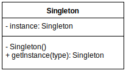

# Singleton

**Type**

Creational pattern.

**Description**

A singleton class has only one instance of itself at a time. Also this pattern provides one global point of access to the class instance. For example "App" class. You need only one instance of your Application across system at a time.

**Advantages**

- Ensure that only one class instance is created
- A global point of access to the class instance
- Lazy initialization

**Disadvantages**

- Creates a global object (global variables are bad)
- Makes difficult to unit testing!

**UML diagramm**

